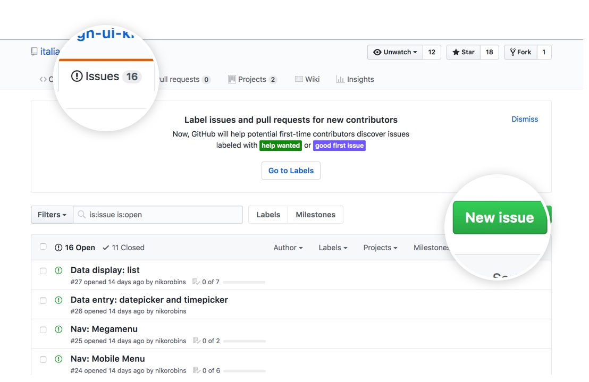

# Contribuire allo UI Kit

Prenditi un momento per leggere questo documento così da rendere il processo semplice e consistente con quello utilizzato
dal resto della comunità dei designers.

Se vuoi contribuire al progetto, prima di creare o modificare dei file, raccontaci quali sono i nuovi componenti che vuoi costruire o quali aspetti vuoi migliorare dello UI Kit esistente. Puoi farlo o creando una issue in questo repository oppure scrivendoci su [Slack](https://slack.designers.italia.it/) o sul [Forum](https://forum.italia.it/c/design/user-interface). Ti verranno fornite indicazioni più dettagliate sia riguardo la naming convention a cui far riferimento sia sull'uso degli stili.  

## Creare una issue

L'[issue tracker](https://github.com/italia/design-ui-kit/issues) è una sezione del repository a cui si accede dal tab menu. 

   
  
  Creare una issue è come scrivere una mail: clicca su *new issue* e si aprirà un editor di testo.  
  
  
  
## Codice di condotta

- Per favore, **non** usare l'issue tracker per richieste di supporto personali.
  [Slack di Designers Italia](https://slack.designers.italia.it/) è il posto giusto a cui fare riferimento e dove sarà anche più facile trovare risposte immediate.

- Allo stesso modo, per favore **non** provocare gli altri o "trollare" nei commenti alle issue.
  Mantenere la discussione pertinente e rispettare le opinioni di tutti. Per confronti o questioni più articolate,
  è sempre auspicabile usare [Slack di Developers Italia](https://slack.developers.italia.it/) o nella [sezione User Interface del Forum](https://forum.italia.it/c/design/user-interface).

## Licenza

Contribuendo alla documentazione accetti di rilasciare i tuoi file secondo la licenza open source già presente nel repository.
