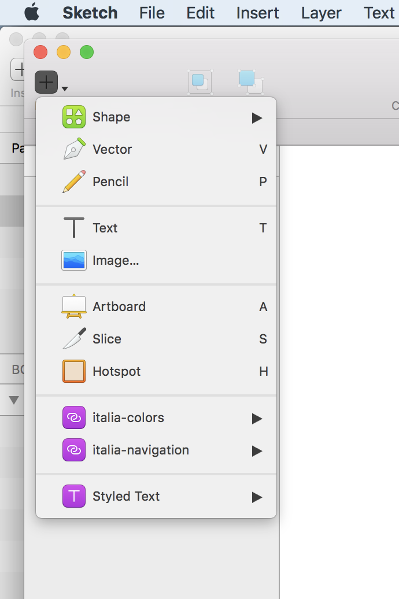
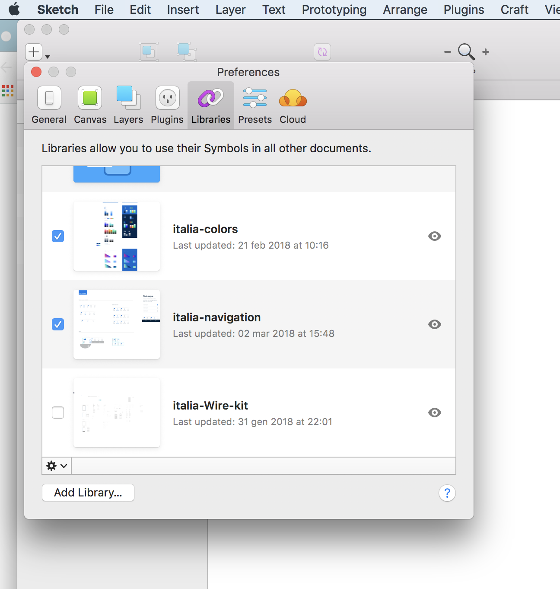

# Istruzioni su come caricare la library dello UI Kit

Le libraries di Sketch ti permettono di avere a disposizione raccolte di simboli che puoi usare in più file. Puoi inoltre tenere aggiornati i tuoi documenti nel caso in cui le libraries dovessero essere modificate.

__Aggiungere la libreria__ 

1. Segui questo link: ……………….
se non hai già un account, ti verrà chiesto di iscriverti a Sketch Cloud
1. Nella sezione documenti condivisi seleziona il documento che ti interessa e comparirà un pulsante che ti permette o di scaricare il file o di aggiungerlo come libreria a Sketch
  
1. Cliccando su “Add library to Sketch” viene richiesta l’apertura automatica di Sketck e il file viene automaticamente aggiunto come libreria rpendendo il nome stesso del file. E’ possibile gestire le librerie dalle Preferences, ossia si possono attivare, disattivare o cancellare.

  
  

__Aggiornare la libreria__
1. Se una libreria è stata modificata apparirà una notifica all’avvio di Sketch. Nel pannello delle preferenze sarà visibile un pulsante contestuale di download per scaricare gli aggiornamenti. 

  

1. Per estendere l’aggiornamento della libreria a tutte le istanze di simboli utilizzate nel documento, basta cliccare nella notifica in alto a destra della finestra di Sketch. Puoi visualizzare le modifiche prima di accettare.

  
