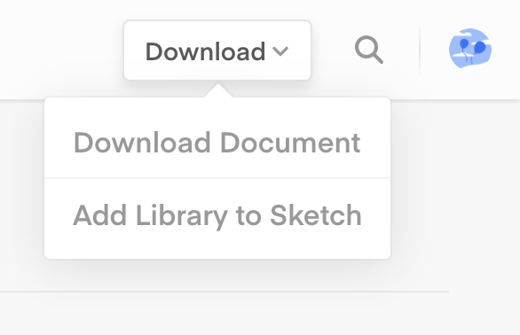
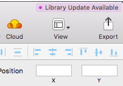

# UI Kit

  
 
Lo UI Kit è parte di un insieme di strumenti condivisi, i [kit di design](https://designers.italia.it/kit/), che servono a progettare e realizzare i servizi digitali destinati ai cittadini. 

L’obiettivo del Kit è quello di migliorare l’user experience dei servizi online attraverso la diffusione di uno stile consistente e coerente.

Abbiamo iniziato a disegnare una libreria di componenti base per poter mettere insieme i layout di un prototipo e lo stiamo facendo seguendo una roadmap dove puoi vedere gli obiettivi dei prossimi mesi e lo stato avanzamento di tutto il kit:

- [roadmap](https://docs.google.com/spreadsheets/d/183hI6EBJo3EeiEcQPGZIe3hNN7EerTU5Udk6SkrH2OU/edit#gid=0)

È infatti un progetto aperto e in continua evoluzione non solo per i componenti ancora da realizzare ma anche per l’implementazione dei file già scaricabili.

## Indice

- [Come iniziare](#come-iniziare)
- [Segnalazione bug e richieste](#segnalazione-bug-e-richieste-di-aiuto)
- [Come contribuire](#come-contribuire)

## Come iniziare

Per utilizzare lo UI Kit all'interno del tuo progetto, puoi caricarlo direttamente come library di Sketch in modo da avere i componenti sempre aggiornati.

Le librerie di Sketch ti permettono di avere a disposizione raccolte di simboli che puoi usare in più file. Puoi inoltre tenere aggiornati i tuoi documenti nel caso in cui le libraries dovessero essere modificate.

### Aggiungere la libreria

1. Segui questo link: https://sketch.cloud/s/Wdy8w
se non hai già un account, ti verrà chiesto di iscriverti a Sketch Cloud
1. Nella sezione documenti condivisi upuoi scaricare il file o di aggiungerlo come libreria a Sketch

    
  
1. Cliccando su “Add library to Sketch” il file viene automaticamente aggiunto come libreria mantenendo il nome del file. È possibile gestire le librerie dalle Preferences: si possono attivare, disattivare o cancellare.

    

    
    
    

### Aggiornare la libreria
1. Se una libreria è stata modificata apparirà una notifica all’avvio di Sketch. Nel pannello delle preferenze sarà visibile un pulsante contestuale di download per scaricare gli aggiornamenti. 

    

1. Per estendere l’aggiornamento della libreria a tutte le istanze di simboli utilizzate nel documento, basta cliccare nella notifica in alto a destra della finestra di Sketch. Puoi visualizzare le modifiche prima di accettare.

    
    

Un altro modo per utilizzare lo UI kit è scaricare i file sketch presenti in questo repository e aggiungerli singolarmente come librerie per avere i componenti sempre a disposizione.

Per lavorare sui file sketch, avrai bisogno di scaricare da Google Font i seguenti typefaces:
- [Titillium](https://fonts.google.com/specimen/Titillium+Web)
- [Roboto Mono](https://fonts.google.com/specimen/Roboto+Mono)

## Segnalazione bug e richieste di aiuto

Vuoi segnalare un bug o fare una richiesta?

Dai un'occhiata a come [creare una issue](https://github.com/italia/design-ui-kit/blob/master/CONTRIBUTING.md#creare-una-issue). Se invece vuoi discutere delle scelte fatte o qualcosa non ti è chiaro, puoi venire a parlarne su [Slack](https://designersitalia.slack.com/messages/C7658JRJR/) o sul [Forum](https://forum.italia.it/) di Deigners Italia.

## Come contribuire

Vorresti dare una mano sullo UI Kit? **Sei nel posto giusto!**
 
Se non l'hai già fatto, inizia spendendo qualche minuto per approfondire la tua conoscenza sulle
[linee guida di design per i servizi web della PA](https://design-italia.readthedocs.io/it/stable/index.html),
e fai riferimento alle [indicazioni su come contribuire allo UI Kit](CONTRIBUTING.md). 
